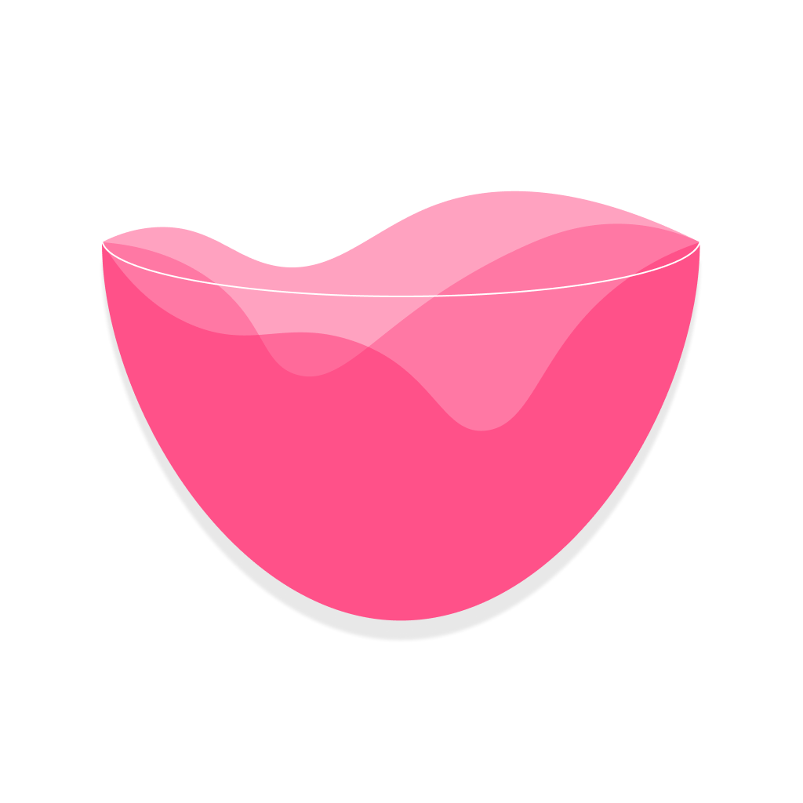

# 사용한 기술스텍
* databinding
* viewModel
* room
* coroutine

 
 

# 폴더링 구조
>📂data 
>>📁remote 
>>📁local 

>📂presentation 
>>📁auth 
>>📁recipe 
>>📁main 
>>>📁home 
>>>📁search 
>>>📁record 
>>>📁mypage 

 
 

# 서비스
### Nobar 
 
칵린이들의 홈텐딩을 도와줄 칵테일 홈텐딩 가이드 앱 

 
 

# 각자 맡은 역할
**윤혁**  
> Mentor

**권용민** 
> SEARCH, RECIPE, RECORD view 

**박현정** 
> MAIN, MYPAGE view 
